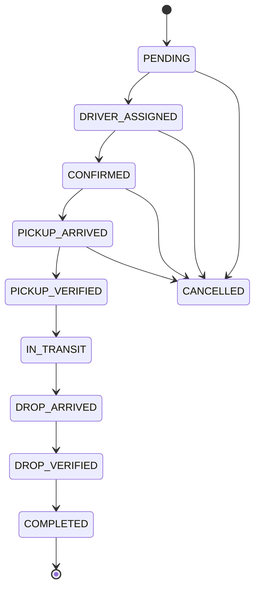

# Booking State Machine

## States

| State | Description | Next Allowed States |
| :--- | :--- | :--- |
| **PENDING** | Initial state after customer creation. | `DRIVER_ASSIGNED`, `CANCELLED` |
| **DRIVER_ASSIGNED** | System/Admin has assigned a driver. | `CONFIRMED`, `CANCELLED` |
| **CONFIRMED** | Driver has accepted the assignment. | `PICKUP_ARRIVED`, `CANCELLED` |
| **PICKUP_ARRIVED** | Driver reached pickup location. | `PICKUP_VERIFIED`, `CANCELLED` |
| **PICKUP_VERIFIED** | OTP match successful. | `IN_TRANSIT` |
| **IN_TRANSIT** | Ride started. | `DROP_ARRIVED` |
| **DROP_ARRIVED** | Driver reached drop location. | `DROP_VERIFIED` |
| **DROP_VERIFIED** | OTP match successful. | `COMPLETED` |
| **COMPLETED** | Payment settled and ride finished. | *None* |
| **CANCELLED** | Stopped by Customer or Admin. | *None* |

## Diagram

