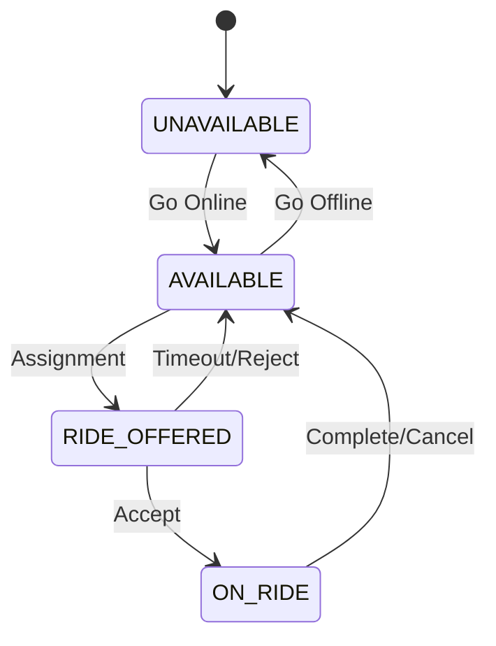

# Driver State Machine

## States

| State | Description | Trigger |
| :--- | :--- | :--- |
| **UNAVAILABLE** | Offline, cannot receive rides. | Manual toggle. |
| **AVAILABLE** | Online, ready for assignment. | Manual toggle / Ride finish. |
| **RIDE_OFFERED** | Temporarily locked for a specific booking. | Assignment Service. |
| **ON_RIDE** | Actively serving a booking. | Booking Acceptance. |

## Transitions

- `AVAILABLE` → `RIDE_OFFERED`: When AssignmentService selects driver.
- `RIDE_OFFERED` → `ON_RIDE`: Driver Accepts.
- `RIDE_OFFERED` → `AVAILABLE`: Driver Rejects / Timeout.
- `ON_RIDE` → `AVAILABLE`: Ride Completed / Cancelled.

## Diagram

