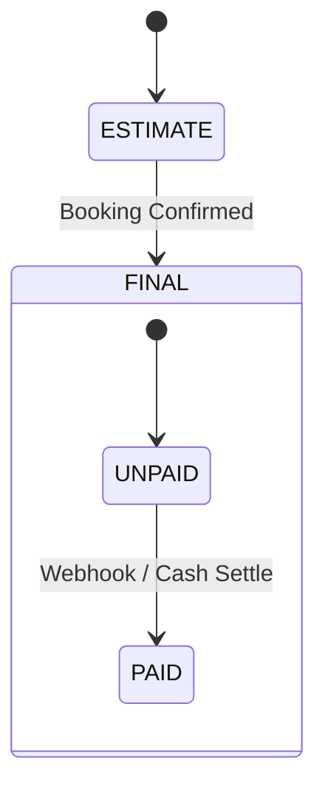

# Payment & Invoice States

## Invoice Types

1.  **ESTIMATE**: Generated at `PENDING` stage. Not billable.
2.  **FINAL**: Generated at `CONFIRMED` stage. Billable.

## Payment Methods

- **ONLINE**: Via Razorpay Payment Link.
- **CASH**: Collected by driver at drop.
- **WALLET**: Deducted from Customer's internal wallet.

## Payment Flow

1.  **Partial Payment (Wallet)**:
    - Wallet balance applied automatically during booking creation.
    - Remaining balance = `totalPrice` - `walletApplied`.
2.  **Full Payment**:
    - If `wallet` covers 100%, invoice is `PAID` immediately.
    - Else, waiting for Online/Cash for remainder.

## Diagram

